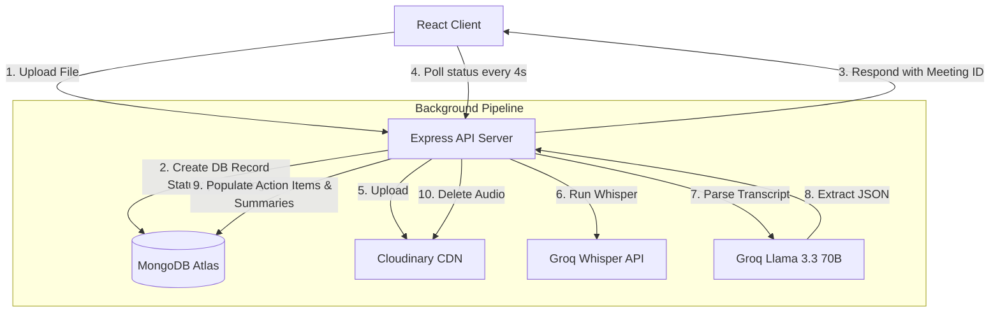

# MeetSense — AI-Powered Meeting Notes & Action Item Extractor

**Designed & Developed by [Samar Hirau](https://samarhirau.dev)**


MeetSense is a full-stack, production-ready SaaS web application that converts meeting audio recordings into structured summaries, key decisions, follow-ups, and an interactive Kanban-style task board. It supports transcription for **English**, **Hindi**, and code-switched **Hinglish** speech.

The application leverages **Groq's Whisper API** for high-fidelity speech-to-text, **Groq's Llama 3.3 70B** for prompt-based structured JSON extraction, and **Cloudinary** for secure, temporary storage of audio files.

---

## 🚀 Key Features

1. **Dual-Layer Authentication**: Register/Login with email and password. Protected routes secure dashboard metrics and meeting files. Uses JWT tokens stored in HTTP-Only cookies with authorization header fallbacks.
2. **Uploader with Real Progress**: Drag-and-drop file uploader (supports `.mp3`, `.wav`, `.mp4`, `.m4a` up to 25MB). Implements an XHR-based uploader which shows a real-time upload progress bar.
3. **Asynchronous Analysis Pipeline**: Pre-saves meetings as `processing` and immediately yields response to the client. This avoids HTTP request timeouts on free-tier hosting (like Render) while background queues execute Cloudinary upload, Whisper transcription, Llama extraction, DB synchronization, and Cloudinary cleanup.
4. **Code-Switched Hinglish Resolution**: Guides Groq's Whisper-large-v3 using contextual vocabulary prompts to accurately transcribe bilingual Conversations.
5. **Interactive Kanban Board**: Extracted action items auto-populate columns (To Do, In Progress, Done). Drag-and-drop cards between states using `@hello-pangea/dnd`. Edit or add tasks manually via in-context editor modals.
6. **Polished SaaS Dashboard**: Notion-style layout featuring search filters, title renaming, processing skeletons, and statistics.
7. **One-Click Export**: Export generated meeting reports to a structured PDF document (using `jspdf` with column pagination) or copy summaries in markdown text directly to the clipboard.

---

## 🛠 Tech Stack

- **Frontend**: React + Vite (TypeScript, Tailwind CSS, Lucide React, Hello Pangea DnD, jsPDF)
- **Backend**: Node.js + Express (TypeScript, Multer, Express Rate Limit, Cookie Parser)
- **Database**: MongoDB Atlas (Mongoose Object Modeling)
- **ML & AI Integration**: Groq SDK (Whisper-large-v3, Llama-3.3-70b-versatile in JSON mode)
- **Audio Storage**: Cloudinary SDK (Temporary secure media uploads)

---

## 🏗 System Architecture



---

## 📂 Folder Structure

```text
MeetSense/
├── extension/                # Manifest V3 Chrome Extension Companion
│   ├── manifest.json         # Extension permissions and configurations
│   ├── background.js         # Service worker hub (persistent state storage)
│   ├── content.js            # Floating status pill overlay for Google Meet
│   ├── offscreen.html/js     # Web Audio API mixer (microphone + tab audio)
│   └── popup.html/js/css     # Dark-themed popup with timer and settings
│
├── backend/                  # Express + TypeScript Server
│   ├── src/
│   │   ├── config/           # Database and Cloudinary client configs
│   │   ├── controllers/      # Auth, Meeting, and Task route logic
│   │   ├── middleware/       # JWT protection, Multer file filters, rate limiters
│   │   ├── models/           # Mongoose schemas (User, Meeting, Task)
│   │   ├── routes/           # REST endpoints mapping
│   │   ├── services/         # Groq Whisper and Llama API configurations
│   │   └── index.ts          # Express entry point
│   ├── package.json
│   └── tsconfig.json
│
├── frontend/                 # React + Vite Client
│   ├── src/
│   │   ├── components/       # Reusable components (KanbanBoard, Navbar)
│   │   ├── context/          # React Auth Context & API fetch helper
│   │   ├── pages/            # View Pages (Auth, Dashboard, MeetingDetails, LandingPage)
│   │   ├── App.tsx           # Page router and route guarding
│   │   ├── index.css         # Tailwind baseline and custom scrollbar styles
│   │   └── main.tsx          # DOM mounter
│   ├── public/               # Static assets folder (hosts meetsense-extension.zip)
│   ├── index.html
│   ├── tailwind.config.js
│   ├── zip-extension.js      # Script to package extension directory to static zip
│   └── package.json
└── README.md
```

---

## 🔑 Environment Variables

To run MeetSense locally, you must create `.env` files.

### Backend Environment Variables (`backend/.env`)
Create `backend/.env` with:
```env
PORT=5000
MONGODB_URI=your_mongodb_atlas_connection_string
JWT_SECRET=your_jwt_secret_key
NODE_ENV=development
FRONTEND_URL=http://localhost:5173

# Groq API Keys (https://console.groq.com/)
GROQ_API_KEY=gsk_xxxxxxxxxxxxxxxxxxxxxx

# Cloudinary Keys (https://cloudinary.com/)
CLOUDINARY_CLOUD_NAME=your_cloudinary_cloud_name
CLOUDINARY_API_KEY=your_cloudinary_api_key
CLOUDINARY_API_SECRET=your_cloudinary_api_secret
```

### Frontend Environment Variables (`frontend/.env`)
Create `frontend/.env` with:
```env
VITE_API_URL=http://localhost:5000/api
```

---

## ⚙ Setup & Installation

### 1. Prerequisite Checks
Confirm you have **Node.js (v18+)** and **npm** installed on your machine.

### 2. Setup Database & APIs
- Register a free tier sandbox on **MongoDB Atlas** and obtain the URI string.
- Register an account on **Cloudinary** and fetch your Cloud name, API Key, and Secret.
- Log in to the **Groq Console**, generate an API key, and configure your keys in the backend `.env`.

### 3. Start Backend Server
```bash
cd backend
npm install
npm run dev
```
The server will start on port `5000` (e.g. `http://localhost:5000`).

### 4. Start Frontend Client
```bash
cd frontend
npm install
npm run dev
```
The Vite development server will spin up on port `5173` (e.g. `http://localhost:5173`). Open your browser to begin transcribing.

### 5. Package & Install Chrome Extension (Developer Mode)
The Chrome Extension can be packaged and loaded into Chrome using these steps:
- **To package/regenerate the downloadable extension zip file**:
  ```bash
  cd frontend
  npm run zip-extension
  ```
  This bundles the `/extension` directory into a static zip archive at `frontend/public/meetsense-extension.zip`. *Note: This step is automatically run during the frontend `npm run build` command.*
- **To install the extension in Chrome**:
  1. Download the zip from the landing page or locate the generated file at `frontend/public/meetsense-extension.zip` and extract it on your local machine.
  2. Open Chrome and navigate to `chrome://extensions`.
  3. Toggle the **"Developer mode"** switch on in the top-right corner.
  4. Click the **"Load unpacked"** button in the top-left and select the extracted extension folder (containing `manifest.json`).
  5. Pin the **MeetSense** extension icon to your browser toolbar.

---

## 📝 MongoDB Schemas

### User
```typescript
{
  name: String,
  email: String, (unique)
  passwordHash: String,
  createdAt: Date
}
```

### Meeting
```typescript
{
  userId: ObjectId (ref: User),
  title: String,
  audioUrl: String, (temporary)
  cloudinaryPublicId: String, (temporary)
  transcript: String,
  summary: String,
  decisions: [String],
  followUps: [String],
  status: 'processing' | 'completed' | 'failed',
  createdAt: Date
}
```

### Task
```typescript
{
  meetingId: ObjectId (ref: Meeting),
  userId: ObjectId (ref: User),
  task: String,
  assignedTo: String, (default: 'Unassigned')
  deadline: String, (default: 'Not specified')
  status: 'todo' | 'in-progress' | 'done',
  createdAt: Date
}
```

---

## 🔮 Future Enhancements
- **Speaker Diarization**: Map and label individual voices during the transcription segment.
- **In-Browser Recorder**: Record meetings directly in the dashboard without uploading files.
- **Calendar Integrations**: Sync Kanban action item deadlines with Google Calendar or Slack reminders.
